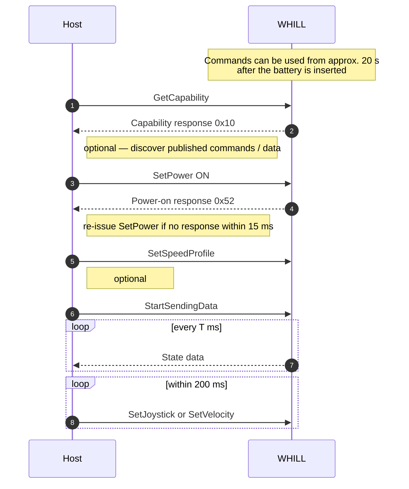
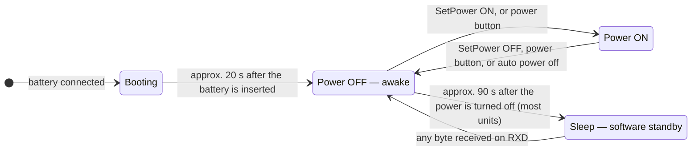
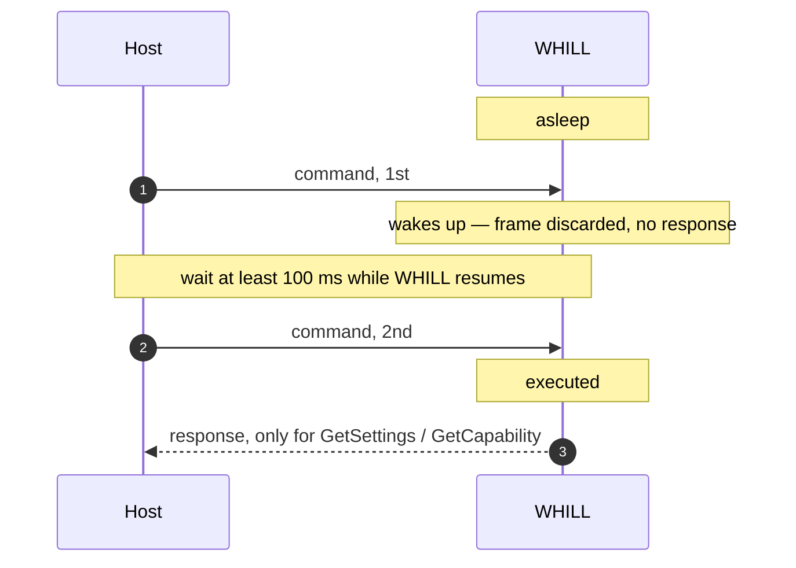
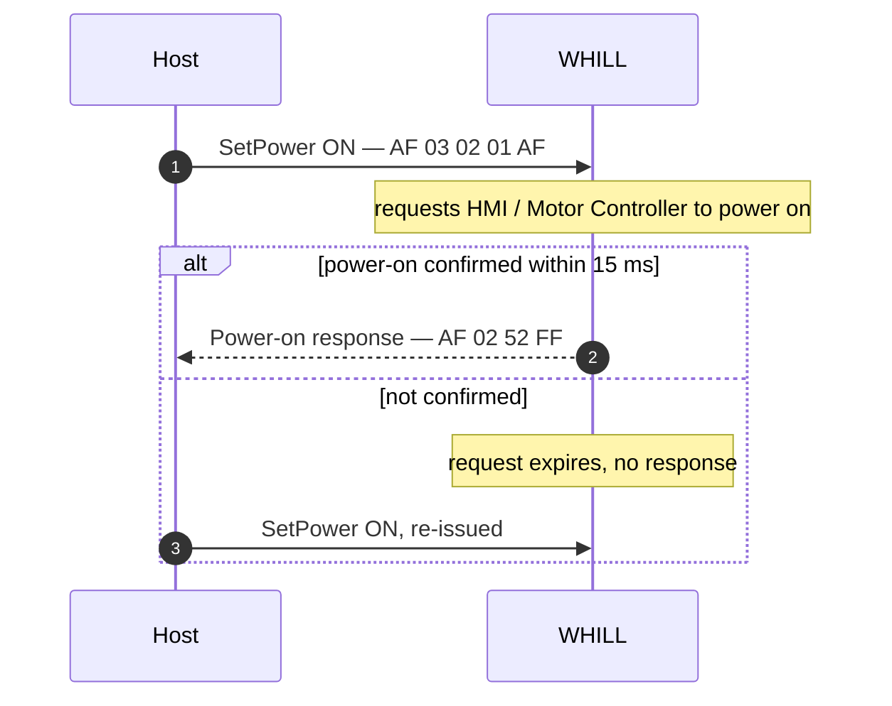
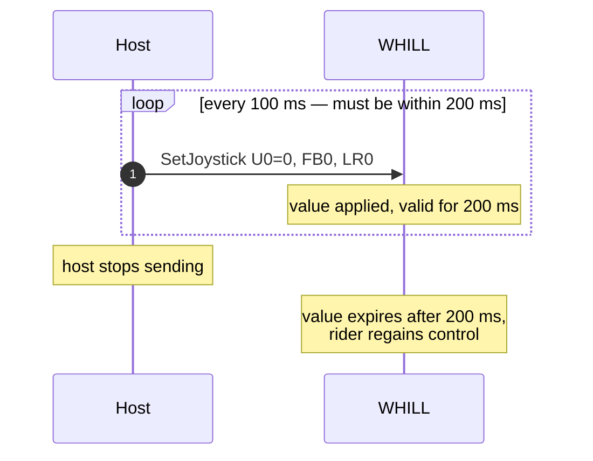
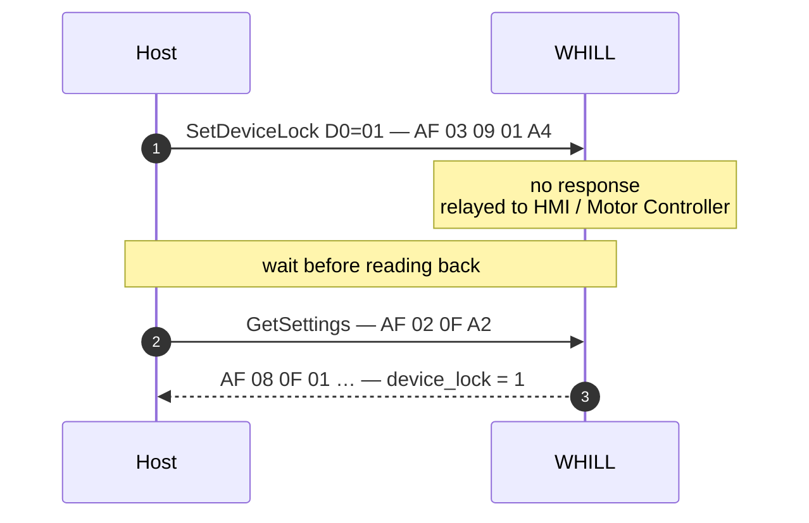
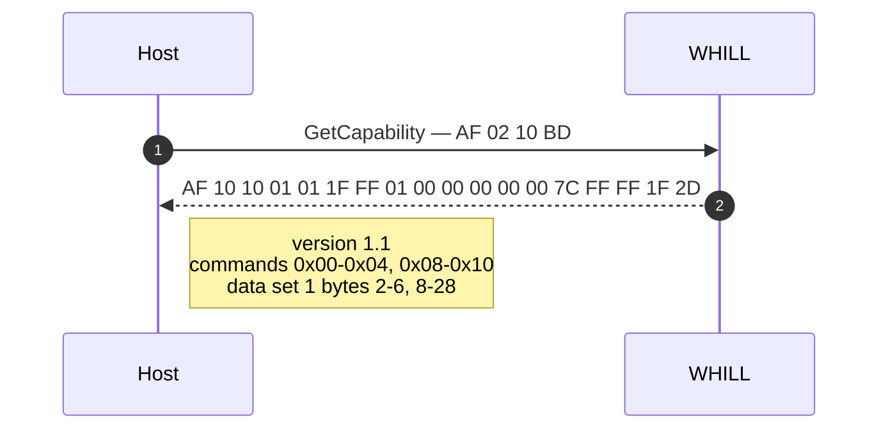
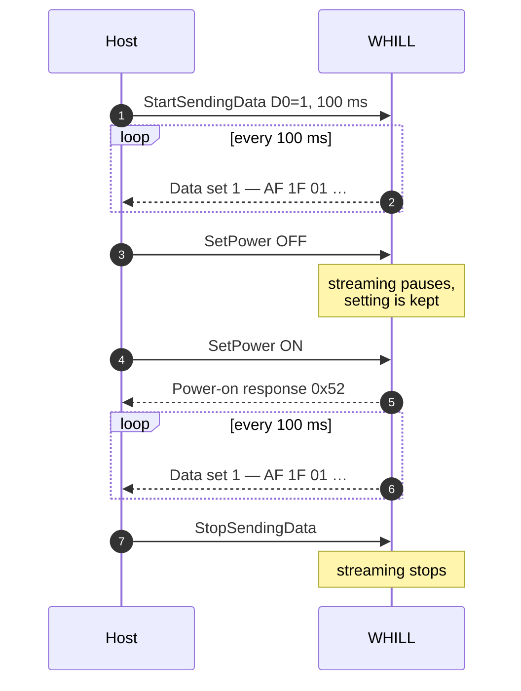

<p align="center">
  
</p>
<h1 align="center">
  WHILL Serial API Specification
</h1>

The **WHILL Serial API** — the serial (RS232C) command and data interface of the **WHILL Model CR2**, provided by WHILL, Inc.

| | |
|---|---|
| **Applies to** | Model CR2, Wheeled Robot Base, Electrical System Kit |
| **Not covered** | Omni Platform (4WD) — see the [Omni Platform specification](https://whill.github.io/whill-serial-api/omni/spec/) |
| **Transport** | RS232C, 38400 bps, 8-N-2 |
| **Serial API version** | 1.1 |
| **Revision** | Rev 1 (2026-09-01) |

> Wheeled Robot Base and Electrical System Kit share the software specification of **Model CR2** — every "Model CR2" description in this document applies to them.

**Notation:** all frame bytes are hexadecimal. `CS` = checksum byte. Ready-made frames in this document already include the correct checksum.

---

## Contents

1. [Overview](#1-overview)
2. [Frame Format](#2-frame-format)
3. [Power State and Sleep](#3-power-state-and-sleep)
4. [Control Commands (Host → WHILL)](#4-control-commands-host--whill)
5. [State Data (WHILL → Host)](#5-state-data-whill--host)
6. [Response Data](#6-response-data)
7. [Timing & Electrical](#7-timing--electrical)
8. [Connector](#8-connector)
9. [Revision History](#9-revision-history)

---

## 1. Overview

The WHILL Serial API is a byte-oriented request/stream interface over RS232C. The host device sends **control commands**; WHILL acts on them. Once the host issues `StartSendingData`, WHILL periodically pushes **state data** (speed, battery level, odometer, motor angles, …) back to the host. A few commands are request/response instead of fire-and-forget, and return **response data**.

### Typical startup sequence



> Control commands can be used from **approximately 20 s after the battery is inserted**, once WHILL has started up and the system has stabilized. Bytes received before that are discarded.

---

## 2. Frame Format

Control commands, state data and response data all share one frame layout:

| Field | Size | Description |
|---|---|---|
| Protocol sign | 1 byte | Always `0xAF`. Marks the start of a frame. |
| Data length | 1 byte | Number of bytes that follow, **including the checksum** (payload + 1). |
| Payload | n bytes | Command ID + command data, or data set number + information. |
| Checksum | 1 byte | XOR of **all** preceding bytes (protocol sign, data length, payload). |

```c
uint8_t checksum(const uint8_t *frame, size_t len_without_checksum) {
    uint8_t cs = 0;
    for (size_t i = 0; i < len_without_checksum; i++) cs ^= frame[i];
    return cs;
}
```

**Identifying frames sent by WHILL** — the first payload byte tells the host what the frame is:

| First payload byte | Frame |
|:---:|---|
| `0x00` | [Data set 0](#51-data-set-0--speed-profile) (speed profile) |
| `0x01` | [Data set 1](#52-data-set-1--live-state) (live state) |
| `0x0F` | [Settings response](#62-settings-response) |
| `0x10` | [Capability response](#63-capability-response) |
| `0x52` | [Power-on response](#61-power-on-response) |

Validate the checksum before acting on a frame, and **ignore frames whose first payload byte you do not handle** — this keeps a host application working when a future Serial API version adds a frame.

A command frame the host sends must not exceed **24 bytes** in total. A frame whose checksum does not match is discarded silently.

---

## 3. Power State and Sleep

WHILL has three states as seen from the serial interface. Which commands take effect, and whether state data is streamed, depends on the current state.



| State | Description | Serial interface |
|---|---|---|
| **Booting** | Approximately **20 s** after the battery is inserted or WHILL is reset. | Received bytes are **discarded**. No command takes effect, no response is returned. |
| **Power OFF — awake** | Power is off, but WHILL is still running internally. | Commands are received. State data is **not** streamed. |
| **Power ON** | Power is on, WHILL can drive. | All commands are received. State data is streamed. |
| **Sleep** | Software standby, entered approximately **90 s** after the power is turned off. | The **first frame received is consumed as the wake-up trigger and discarded**. See [§3.2](#32-waking-whill-up-from-sleep). |

> Units shipped in certain periods do not enter software standby and behave differently on a low battery — see [§3.3](#33-deep-sleep-on-low-battery-some-units).

### 3.1 Command availability per state

| Command | Power ON | Power OFF — awake |
|---|:---:|---|
| [`SetPower`](#43-setpower-0x02) | ✅ | ✅ |
| [`SetSpeedLevel`](#410-setspeedlevel-0x0c) | ❌ ignored | ✅ — this is the intended state |
| [`SetDeviceLock`](#47-setdevicelock-0x09) / [`GetSettings`](#413-getsettings-0x0f) | ✅ | ✅ |
| [`GetCapability`](#414-getcapability-0x10) | ✅ | ✅ |
| [`StartSendingData`](#41-startsendingdata-0x00) / [`StopSendingData`](#42-stopsendingdata-0x01) | ✅ | ▲ streaming resumes at the next power-on |
| [`SetSpeedProfile`](#45-setspeedprofile-0x04) | ✅ | ▲ read back with data set 0 once the power is on |
| [`SetJoystickPause`](#48-setjoystickpause-0x0a) | ✅ | ▲ read back with `GetSettings` |
| [`SetMaxSpeedLevel`](#49-setmaxspeedlevel-0x0b) | ✅ | ▲ read back with `GetSettings` |
| [`SetAutoPowerOff`](#412-setautopoweroff-0x0e) | ✅ | ▲ read back with `GetSettings` |
| [`SoundHorn`](#411-soundhorn-0x0d) | ✅ | ✅ |
| [`SetJoystick`](#44-setjoystick-0x03) / [`SetVelocity`](#46-setvelocity-0x08) | ✅ | ❌ not accepted while the power is off |
| Data set 0 / data set 1 streaming | ✅ | ❌ paused |

> ✅ = supported · ▲ = accepted; confirm the result before relying on it · ❌ = not accepted / no effect.

[`SetPower`](#43-setpower-0x02), [`SetSpeedLevel`](#410-setspeedlevel-0x0c), [`SetDeviceLock`](#47-setdevicelock-0x09), [`GetSettings`](#413-getsettings-0x0f) and [`GetCapability`](#414-getcapability-0x10) are the commands intended for use while the power is off. The commands marked ▲ **may be used as well** — they are accepted in this state — but their effect is not directly observable here, because state data is not streamed while the power is off. Read the result back with [`GetSettings`](#413-getsettings-0x0f) before relying on it; for values `GetSettings` does not report, confirm them once the power is on.

A command that is not accepted in the current state is received and discarded harmlessly — it never leaves WHILL in a bad state.

**Reading settings while the power is off** — the data set 1 setting fields are streamed only while the power is on. Use [`GetSettings`](#413-getsettings-0x0f) when the power may be off; it answers in every state.

### 3.2 Waking WHILL up from sleep

Incoming data on the RS232C RX line is what wakes WHILL up — no special wake-up sequence is needed. However, the **first command received is consumed as the wake-up trigger and is discarded**: it is not executed, and no response is returned for it.

**Send the command twice, with an interval of at least 100 ms**, to have it take effect while WHILL may be asleep.



> ⚠️ The 100 ms interval is **required**, not just recommended. WHILL needs time to resume after being woken, and a second frame sent too early is discarded as well.

All commands that are recommended while the power is off (`SetPower`, `SetSpeedLevel`, `SetDeviceLock`, `GetSettings`, `GetCapability`) are idempotent, so sending them twice is harmless. Note that if WHILL was already awake, **both** frames are executed — expect **two responses** from `GetSettings` and `GetCapability` in that case.

A missing response is therefore not an error condition on its own. Re-issue the request rather than treating the first timeout as a failure.

### 3.3 Deep sleep on low battery (some units)

Most WHILLs behave as described above. **WHILLs shipped in certain periods** do not enter software standby after the power is turned off. Instead they shut down into a **deep sleep** as soon as the battery level reaches **19 % or below**. This is evaluated in **both power states, including while driving** — such a unit stops at 19 % rather than running the battery down to 0 %. Size the duty cycle of your application accordingly.

A WHILL in deep sleep responds to nothing on RXD. The wake-up procedure of [§3.2](#32-waking-whill-up-from-sleep) does **not** recover it, and no amount of retrying will. Treat a WHILL that stays silent throughout that procedure as needing physical intervention, not as a communication fault.

**Recovery**

1. Set the power switch to off.
2. Remove the battery from the WHILL.
3. Leave the battery out for **at least 20 minutes**, so that the WHILL discharges completely.
4. Install a fully charged battery.

> Connecting a charger to the installed battery does **not** recover the unit. Steps 3 and 4 are both required.

**Does this apply to my WHILL?** Turn the power off, wait about **2 minutes**, then send [`GetSettings`](#413-getsettings-0x0f) **once**. A WHILL that has entered software standby consumes that first frame as its wake-up trigger and stays silent; a WHILL that **answers** never went to sleep, and is one of the units described here.

---

## 4. Control Commands (Host → WHILL)

| ID | Command | Purpose | Response |
|:---:|---|---|---|
| `0x00` | [StartSendingData](#41-startsendingdata-0x00) | Start periodic state data | none |
| `0x01` | [StopSendingData](#42-stopsendingdata-0x01) | Stop periodic state data | none |
| `0x02` | [SetPower](#43-setpower-0x02) | Power ON / OFF | [0x52](#61-power-on-response) on power-on |
| `0x03` | [SetJoystick](#44-setjoystick-0x03) | Take over control, set joystick value | none |
| `0x04` | [SetSpeedProfile](#45-setspeedprofile-0x04) | Set max speed / accel / decel | none |
| `0x08` | [SetVelocity](#46-setvelocity-0x08) | Set velocity directly | none |
| `0x09` | [SetDeviceLock](#47-setdevicelock-0x09) | Lock / unlock the mobility device | none |
| `0x0A` | [SetJoystickPause](#48-setjoystickpause-0x0a) | Pause / resume joystick driving | none |
| `0x0B` | [SetMaxSpeedLevel](#49-setmaxspeedlevel-0x0b) | Limit the selectable speed level | none |
| `0x0C` | [SetSpeedLevel](#410-setspeedlevel-0x0c) | Select the speed level | none |
| `0x0D` | [SoundHorn](#411-soundhorn-0x0d) | Sound the horn | none |
| `0x0E` | [SetAutoPowerOff](#412-setautopoweroff-0x0e) | Enable / disable auto power off | none |
| `0x0F` | [GetSettings](#413-getsettings-0x0f) | Read the current value of every setting | [0x0F](#62-settings-response) |
| `0x10` | [GetCapability](#414-getcapability-0x10) | Read the published commands / data | [0x10](#63-capability-response) |

> Command IDs not listed above (`0x05`–`0x07`, and `0x11` and above) are **reserved**. Do not use them; they are excluded from the [capability response](#63-capability-response) and their behaviour may change without notice.

**Settings are reset when the battery is removed and re-inserted.** Values applied by the commands in this section return to their defaults, so the host must set them again after a battery change. The only exceptions are [`SetSpeedProfile`](#45-setspeedprofile-0x04) and [`SetDeviceLock`](#47-setdevicelock-0x09), which are retained.

### 4.1 StartSendingData (`0x00`)

Starts periodic transmission of state data.

```
AF 06 00 D0 T1 T0 S0 CS
```

| Field | Description |
|---|---|
| `D0` | Data set number: `0` = [data set 0](#51-data-set-0--speed-profile), `1` = [data set 1](#52-data-set-1--live-state) |
| `T1` `T0` | Send interval in ms, 16-bit (`T1` = MSB, `T0` = LSB). **Minimum 10 ms.** |
| `S0` | Speed mode reported in data set 0 (see [SetSpeedProfile](#45-setspeedprofile-0x04)) |

**Ready-made frames**

| Operation | Frame |
|---|---|
| Data set 1, every 100 ms, speed mode 4 | `AF 06 00 01 00 64 04 C8` |
| Data set 0, every 1000 ms, speed mode 4 | `AF 06 00 00 03 E8 04 46` |

> - The command is rejected as a whole if `D0`, `S0` or the interval is out of range.
> - **Only one data set is streamed at a time.** A second `StartSendingData` replaces the previous setting rather than adding a second stream. To read data set 0, switch the stream to data set 0, take one frame, then switch back to data set 1.
> - State data is streamed **only while WHILL is powered on**. The stream pauses while the power is off and resumes automatically after the next power-on; the setting itself is kept.

### 4.2 StopSendingData (`0x01`)

Stops periodic transmission.

```
AF 02 01 AC
```

### 4.3 SetPower (`0x02`)

```
AF 03 02 P0 CS
```

| Field | Description |
|---|---|
| `P0` | `0` = Power OFF, `1` = Power ON |

**Ready-made frames**

| Operation | Frame |
|---|---|
| Power ON | `AF 03 02 01 AF` |
| Power OFF | `AF 03 02 00 AE` |



> **Important**
> - After power-on completes, WHILL returns the [power-on response](#61-power-on-response). Send no other command until it arrives.
> - WHILL answers only if the power-on is confirmed within **15 ms** of accepting the command. Powering on physically takes longer than that, so **re-issue `SetPower` (ON) until the response arrives** — several attempts are normal.
> - After sending Power OFF, wait **more than 5 s** before sending Power ON.
> - Power ON has **no effect while WHILL is locked** by [`SetDeviceLock`](#47-setdevicelock-0x09). Unlock it first.

### 4.4 SetJoystick (`0x03`)

Switches control between the rider and the host, and sets the joystick value.

```
AF 05 03 U0 FB0 LR0 CS
```

| Field | Description |
|---|---|
| `U0` | `0` = host control — apply `FB0` / `LR0`<br>`1` = do not apply any value; control stays with the rider |
| `FB0` | Front/back value, −100 … 100 (8-bit signed) |
| `LR0` | Left/right value, −100 … 100 (8-bit signed) |

Example — half forward, no turn: `AF 05 03 00 32 00 9B`

> - A single command stays effective for **200 ms**. Resend within that window to keep WHILL moving.
> - Out-of-range values are **limited** into −100 … 100 rather than rejected.
> - `U0 = 1` applies no value. Control returns to the rider once the last `U0 = 0` command expires, so simply stopping the 200 ms loop is equivalent.



### 4.5 SetSpeedProfile (`0x04`)

Sets max speed, acceleration and deceleration for forward, reverse and turn motion, per speed mode.

```
AF 0C 04 S1 F_M1 F_A1 F_D1 R_M1 R_A1 R_D1 T_M1 T_A1 T_D1 CS
```

**`S1` — speed mode to configure**

| Value | Speed mode |
|:---:|---|
| 0–3 | Rider joystick, indicator showing `1`–`4` respectively |
| 4 | Host control via RS232C |
| 5 | BLE (WHILL app) |

**Parameters** (speed unit = 0.1 km/h, e.g. `30` → 3.0 km/h)

| Field | Description | Range |
|---|---|---|
| `F_M1` | Forward max speed | 8–60 |
| `F_A1` | Forward acceleration | 10–64 |
| `F_D1` | Forward deceleration | 40–160 |
| `R_M1` | Reverse max speed | 8–30 |
| `R_A1` | Reverse acceleration | 10–50 |
| `R_D1` | Reverse deceleration | 40–80 |
| `T_M1` | Turn max speed | 8–35 |
| `T_A1` | Turn acceleration | 10–60 |
| `T_D1` | Turn deceleration | 40–160 |

Example — speed mode 4 set to 3.0 / 2.0 / 2.5 km/h: `AF 0C 04 04 1E 19 38 14 19 38 19 19 38 91`

> A command containing any out-of-range value is **discarded as a whole** — no parameter is applied. The result can be read back with [data set 0](#51-data-set-0--speed-profile).

### 4.6 SetVelocity (`0x08`)

Same control hand-over as `SetJoystick`, but sets velocity directly.

```
AF 07 08 U0 Y1 Y0 X1 X0 CS
```

| Field | Description |
|---|---|
| `U0` | `0` = host control — apply `Y` / `X`<br>`1` = do not apply any value; control stays with the rider |
| `Y1` `Y0` | Front/back velocity, 16-bit signed, −500 … 1500, unit 0.004 km/h |
| `X1` `X0` | Left/right velocity, 16-bit signed, −750 … 750, unit 0.004 km/h |

Example — 1.0 km/h forward, no turn: `AF 07 08 00 00 FA 00 00 5A`

**Differences from `SetJoystick`**

- Velocity is sent directly, independent of the speed profile, and at finer resolution.
- Acceleration is constant and fast (approx. 1.7 m/s²) so WHILL reaches the target speed as quickly as possible.

> ⚠️ **WHILL accelerates aggressively with this command.** Ramp the target speed up gradually.

Values stay effective for **200 ms**; resend within that window to keep moving. Out-of-range values are **limited** into the ranges above rather than rejected.

### 4.7 SetDeviceLock (`0x09`)

Locks or unlocks the mobility device.

```
AF 03 09 D0 CS
```

| Field | Description |
|---|---|
| `D0` | `1` = lock. **Any other value = unlock.** |

**Ready-made frames**

| Operation | Frame |
|---|---|
| Lock | `AF 03 09 01 A4` |
| Unlock | `AF 03 09 00 A5` |

> ⚠️ `D0` is tested for equality with `1`, so any value other than `1` — not just `0` — is treated as **unlock** rather than being rejected. A corrupted or mistyped parameter therefore unlocks. Send exactly `01` to lock, and confirm the result with [`GetSettings`](#413-getsettings-0x0f).



**Notes**

- There is **no response**. To confirm the new state, follow with `GetSettings`.
- The request is relayed to the HMI and Motor Controller, so the state change is not instantaneous. Allow a short interval before reading it back.
- Accepted **regardless of the power state**.
- **Locking turns the power off**, and [`SetPower`](#43-setpower-0x02) (ON) has no effect while WHILL is locked. To drive a locked WHILL, unlock it first and then send `SetPower` (ON).

The current state is also reported in [data set 1](#52-data-set-1--live-state) byte 2 (`DEVICE_LOCK`) while the power is on.

### 4.8 SetJoystickPause (`0x0A`)

Pauses or resumes joystick control of the chair.

```
AF 03 0A D0 CS
```

| Field | Description |
|---|---|
| `D0` | `1` = pause. **Any other value = resume.** |

**Ready-made frames**

| Operation | Frame |
|---|---|
| Pause | `AF 03 0A 01 A7` |
| Resume | `AF 03 0A 00 A6` |

> While paused, only the joystick's **effect on driving** is suppressed. The joystick keeps being read and its value keeps streaming in data set 1 (`JOY_FRONT` / `JOY_SIDE`).
>
> This is unrelated to [`SetDeviceLock`](#47-setdevicelock-0x09), which locks the mobility device itself.

The current state is reported in [data set 1](#52-data-set-1--live-state) byte 3 (`JOYSTICK_PAUSE`).

### 4.9 SetMaxSpeedLevel (`0x0B`)

Limits the highest speed level the rider can select.

```
AF 03 0B S0 CS
```

| Field | Description |
|---|---|
| `S0` | Max usable speed level, **1–4** |

**Ready-made frames**

| Operation | Frame |
|---|---|
| Limit to level 1 | `AF 03 0B 01 A6` |
| Limit to level 2 | `AF 03 0B 02 A5` |
| Limit to level 3 | `AF 03 0B 03 A4` |
| No limit (level 4) | `AF 03 0B 04 A3` |

> Out-of-range values are **clamped into 1–4** rather than rejected, so a malformed request never leaves WHILL with a looser limit than intended. `0` becomes `1`, and `5` or above becomes `4`.

The current value is reported in [data set 1](#52-data-set-1--live-state) byte 4 (`MAX_SPEED_LEVEL`), which is **1-based** like `S0`. The speed mode the Motor Controller actually applies is reported in byte 26 (`SPEED_MODE_INDICATOR`), which is **0-based**.

### 4.10 SetSpeedLevel (`0x0C`)

Selects the speed level.

```
AF 03 0C S0 CS
```

| Field | Description |
|---|---|
| `S0` | Speed level, 1–4. Out-of-range values are rejected. |

**Ready-made frames**

| Operation | Frame |
|---|---|
| Level 1 | `AF 03 0C 01 A1` |
| Level 2 | `AF 03 0C 02 A2` |
| Level 3 | `AF 03 0C 03 A3` |
| Level 4 | `AF 03 0C 04 A4` |

> Applied while WHILL is **OFF or in standby**; the command is **ignored while WHILL is powered on**. The speed indicator LED is not refreshed by this command.
>
> To change the level of a running WHILL, power it off, send `SetSpeedLevel`, then power it on again — leaving more than 5 s between Power OFF and Power ON.

The current value is reported in [data set 1](#52-data-set-1--live-state) byte 5 (`SPEED_LEVEL`). That field reports the **selected** level and is not reduced by [`SetMaxSpeedLevel`](#49-setmaxspeedlevel-0x0b); the level actually in effect is byte 26 (`SPEED_MODE_INDICATOR`).

### 4.11 SoundHorn (`0x0D`)

Sounds the horn.

```
AF 03 0D D0 CS
```

| Field | Description |
|---|---|
| `D0` | `1` = sound the horn. Any other value is ignored. |

Ready-made frame: `AF 03 0D 01 A0`

> Momentary trigger — the horn sounds once per command. There is no "stop" value. The sound length and pattern are determined by WHILL.

### 4.12 SetAutoPowerOff (`0x0E`)

Enables or disables **auto power off** — WHILL turning its own power off after a period of inactivity.

```
AF 03 0E D0 CS
```

| Field | Description |
|---|---|
| `D0` | `1` = enable auto power off. **Any other value = disable.** |

**Ready-made frames**

| Operation | Frame |
|---|---|
| Enable (default) | `AF 03 0E 01 A3` |
| Disable — keep WHILL powered on | `AF 03 0E 00 A2` |

> - Auto power off is **enabled** when WHILL boots. A host that needs WHILL to stay powered on indefinitely must disable it explicitly.
> - Disabling it keeps WHILL powered on even with no rider input; the rider can still power off with the power button, and `SetPower` (OFF) still works.
> - The setting is held in RAM. It survives a power off/on cycle, but returns to **enabled** when WHILL itself is reset (battery disconnected / reboot).
> - The setting only affects the inactivity timeout while the power is **on**. It does not change how long WHILL stays awake before entering [sleep](#32-waking-whill-up-from-sleep) after a power off.

The current state is reported in [data set 1](#52-data-set-1--live-state) byte 6 (`AUTO_POWER_OFF`).

---

### 4.13 GetSettings (`0x0F`)

Reads the current value of every setting in one request. No parameter.

```
AF 02 0F A2
```

WHILL replies with the [settings response](#62-settings-response).

**What is covered** — one field per `Set*` command whose effect persists:

| Command | Field returned |
|---|---|
| [`SetPower`](#43-setpower-0x02) | `POWER_ON` |
| [`SetDeviceLock`](#47-setdevicelock-0x09) | `DEVICE_LOCK` |
| [`SetJoystickPause`](#48-setjoystickpause-0x0a) | `JOYSTICK_PAUSE` |
| [`SetMaxSpeedLevel`](#49-setmaxspeedlevel-0x0b) | `MAX_SPEED_LEVEL` |
| [`SetSpeedLevel`](#410-setspeedlevel-0x0c) | `SPEED_LEVEL` |
| [`SetAutoPowerOff`](#412-setautopoweroff-0x0e) | `AUTO_POWER_OFF` |

`SetJoystick`, `SetVelocity` and `SoundHorn` are **not** covered — they are momentary and hold no lasting value. `SetSpeedProfile` is not covered either; it is per speed mode, so read it back with [data set 0](#51-data-set-0--speed-profile).

> The `Set*` commands above return no response of their own. `GetSettings` is how a host confirms that a setting was received and applied — send the setting, then read it back.
>
> Unlike the data set 1 fields — which are streamed **only while WHILL is powered on** — this request/response works regardless of power state. WHILL keeps the state up to date internally, so it answers even while the power is off, subject to the [sleep behaviour](#32-waking-whill-up-from-sleep).
>
> The state change of `SetDeviceLock`, `SetSpeedLevel` and `SetMaxSpeedLevel` is relayed internally and is not instantaneous. Allow a short interval before reading it back.
>
> If the reply does not arrive, re-issue the request. WHILL does not retransmit on its own.

### 4.14 GetCapability (`0x10`)

Reads which commands and which data set 1 fields this WHILL publishes. No parameter.

```
AF 02 10 BD
```

WHILL replies with the [capability response](#63-capability-response).



> The reply is fixed per **Serial API version** and does not depend on the connected HMI / Motor Controller firmware version, nor on the power state. Use it to keep a host application compatible across WHILL firmware revisions.

> ⚠️ **No reply to `GetCapability`?** Rule out the ordinary causes first — the approximately **20 s** start-up after the battery is inserted, and the [sleep behaviour](#32-waking-whill-up-from-sleep) (send the command twice, at least 100 ms apart). A WHILL that still answers nothing does not implement `GetCapability` and **predates this specification**. Use the earlier [*WHILL Control System Protocol Specification*](https://github.com/WHILL/whill_control_system_protocol_specification/blob/master/WHILL_Control_System_Protocol_Specification.pdf) for such a unit — the commands it accepts and the state data it publishes differ from the ones documented here.

## 5. State Data (WHILL → Host)

After `StartSendingData`, WHILL sends frames in the [common format](#2-frame-format) with this payload:

```
AF <len> <data set number> <information[0]> … <information[n]> CS
```

State data is sent **only while WHILL is powered on**.



### 5.1 Data set 0 — speed profile

```
AF 0C 00 <information[0]> … <information[9]> CS
```

Values only change when the host changes settings, so reading it once at power-on (and after any `SetSpeedProfile`) is normally enough. Fields correspond to [SetSpeedProfile](#45-setspeedprofile-0x04).

| # | Value (8 bit) | Description |
|:---:|---|---|
| 0 | `SPEED_MODE` | Speed mode being reported |
| 1 | `FORWARD_SPEED_MAX` | Forward max speed |
| 2 | `FORWARD_ACCEL` | Forward acceleration |
| 3 | `FORWARD_DECEL` | Forward deceleration |
| 4 | `REVERSE_SPEED_MAX` | Reverse max speed |
| 5 | `REVERSE_ACCEL` | Reverse acceleration |
| 6 | `REVERSE_DECEL` | Reverse deceleration |
| 7 | `TURN_SPEED_MAX` | Turn max speed |
| 8 | `TURN_ACCEL` | Turn acceleration |
| 9 | `TURN_DECEL` | Turn deceleration |

### 5.2 Data set 1 — live state

```
AF 1F 01 <information[0]> … <information[28]> CS
```

Continuously changing values (settings echo, odometer, joystick, battery current, motor state, …). The frame is always **33 bytes** in total.

| # | Value (8 bit) | Description |
|:---:|---|---|
| 0–1 | *(reserved)* | Not part of the public API. Ignore. |
| 2 | `DEVICE_LOCK` | Device lock state set by [SetDeviceLock](#47-setdevicelock-0x09). `1` = locked, `0` = unlocked |
| 3 | `JOYSTICK_PAUSE` | Joystick pause state set by [SetJoystickPause](#48-setjoystickpause-0x0a). `1` = paused, `0` = resumed |
| 4 | `MAX_SPEED_LEVEL` | Max usable speed level (**1–4**) set by [SetMaxSpeedLevel](#49-setmaxspeedlevel-0x0b) |
| 5 | `SPEED_LEVEL` | Speed level (**1–4**) currently selected on the WHILL — [Note 1](#note-1--speed_level) |
| 6 | `AUTO_POWER_OFF` | Auto power off state set by [SetAutoPowerOff](#412-setautopoweroff-0x0e). `1` = enabled, `0` = disabled |
| 7 | *(reserved)* | Not part of the public API. Ignore. |
| 8–11 | `TRIP_DISTANCE` (MSB … LSB) | Odometer — [Note 2](#note-2--trip_distance) |
| 12 | `JOY_FRONT` | Physical joystick, front/back (−100 … 100). Not the host-set value. |
| 13 | `JOY_SIDE` | Physical joystick, left/right (−100 … 100). Not the host-set value. |
| 14 | `BATTERY_POWER` | Battery level, 0–100 % |
| 15–16 | `BATTERY_CURRENT` (MSB, LSB) | Battery current — [Note 3](#note-3--battery-current) |
| 17–18 | `RIGHT_MOTOR_ANGLE` (MSB, LSB) | Right motor angle — [Note 4](#note-4--motor-angle) |
| 19–20 | `LEFT_MOTOR_ANGLE` (MSB, LSB) | Left motor angle — [Note 4](#note-4--motor-angle) |
| 21–22 | `RIGHT_MOTOR_SPEED` (MSB, LSB) | Right motor speed — [Note 5](#note-5--motor-speed) |
| 23–24 | `LEFT_MOTOR_SPEED` (MSB, LSB) | Left motor speed — [Note 5](#note-5--motor-speed) |
| 25 | `POWER_ON` | Power state. **Always `1`** here — [Note 6](#note-6--power_on) |
| 26 | `SPEED_MODE_INDICATOR` | Speed mode the Motor Controller actually applies — [Note 7](#note-7--speed_mode_indicator) |
| 27 | `ERROR` | Error code. `0` = no error. |
| 28 | `ANGLE_DETECT_COUNTER` | Motor-angle sampling timing — [Note 8](#note-8--angle_detect_counter) |

> Reserved bytes are still transmitted so that the byte offsets above stay fixed, but their contents are not part of the public API. Use [`GetCapability`](#414-getcapability-0x10) to confirm which offsets are published.
>
> Bytes 2–6 are the settings, in the same order as the command IDs that set them and as the [settings response](#62-settings-response) — the same extraction code works for both.

#### Note 1 — `SPEED_LEVEL`

The speed level currently selected on the WHILL, matching the speed indicator LED. It is **1-based** (`1`–`4`) and reports the **selected** value: it is not reduced when [`SetMaxSpeedLevel`](#49-setmaxspeedlevel-0x0b) caps the speed. To know the level actually in effect, use `SPEED_MODE_INDICATOR` (byte 26).

Example — level 4 selected with the max level set to 2: `SPEED_LEVEL` = 4, `MAX_SPEED_LEVEL` = 2, `SPEED_MODE_INDICATOR` = 1.

#### Note 2 — `TRIP_DISTANCE`

Total travel distance (odometer). 32-bit **unsigned**, MSB first, unit **1 m**.

```c
uint32_t trip_distance_m = ((uint32_t)info[8]  << 24)
                         | ((uint32_t)info[9]  << 16)
                         | ((uint32_t)info[10] <<  8)
                         |  (uint32_t)info[11];
```

Example: `00 00 0B B8` → 3000 → **3000 m** (3.0 km)

> ⚠️ The **unit is 1 m but the resolution is 10 m.** The value is counted in 10 m steps inside WHILL, so `TRIP_DISTANCE` always advances in multiples of 10. Do not expect metre-by-metre granularity.

The value is cumulative and is not cleared by a power off/on cycle.

#### Note 3 — Battery current

16-bit signed, unit **2 mA**, sampled at 4 Hz. Reads `0` while the current is within ±75 mA.

Examples: `0x0035` → 106 mA · `0xFF97` → −210 mA

#### Note 4 — Motor angle

16-bit signed, unit **0.001 rad**, range ±π rad.

Example: `0x0600` → 1.536 rad

#### Note 5 — Motor speed

16-bit signed, unit **0.004 km/h**.

Example: `0x01F4` → 2 km/h

#### Note 6 — `POWER_ON`

**Always reads `1` in data set 1.** Data set 1 is streamed only while WHILL is powered on, and this byte
reports the very same power state that gates the stream — so a value of `0` never reaches the host here.

To read the power state, use [`GetSettings`](#413-getsettings-0x0f), which answers regardless of power
state. To detect a power-off, watch for the stream stopping, or poll `GetSettings`.

> The field is kept at its published offset so that existing parsers are unaffected.

#### Note 7 — `SPEED_MODE_INDICATOR`

The speed mode the Motor Controller actually applies, **0-based**: mode `0`–`3` correspond to speed level `1`–`4`.

> Note the different base from `SPEED_LEVEL` (byte 4) and `MAX_SPEED_LEVEL` (byte 3), which are 1-based.

#### Note 8 — `ANGLE_DETECT_COUNTER`

Indicates when the motor angles were sampled; used to improve odometry accuracy.

| | |
|---|---|
| Unit | 10 ms |
| Range | 0–255 |

Example — two consecutive frames showing the right motor turning 0.088 rad in 20 ms:

```
RIGHT_MOTOR_ANGLE: 1.536 rad, ANGLE_DETECT_COUNTER: 110
RIGHT_MOTOR_ANGLE: 1.624 rad, ANGLE_DETECT_COUNTER: 112
```

---

## 6. Response Data

Frames WHILL returns in reply to a specific command. Each carries an identifying **first payload byte** — see [§2](#2-frame-format).

### 6.1 Power-on response

Sent once power-on completes after a [`SetPower`](#43-setpower-0x02) (ON) command. The response byte is always `0x52`.

```
AF 02 52 FF
```

> After sending `SetPower` (ON), send no other command until the response arrives. If it does not arrive within **15 ms**, re-issue `SetPower` (ON).

### 6.2 Settings response

Reply to [`GetSettings`](#413-getsettings-0x0f).

```
AF 08 0F L0 P0 M0 S0 A0 O0 CS
```

| Field | Description |
|---|---|
| `L0` | `DEVICE_LOCK` — `1` = locked, `0` = unlocked |
| `P0` | `JOYSTICK_PAUSE` — `1` = paused, `0` = resumed |
| `M0` | `MAX_SPEED_LEVEL` — 1–4 |
| `S0` | `SPEED_LEVEL` — 1–4 |
| `A0` | `AUTO_POWER_OFF` — `1` = enabled, `0` = disabled |
| `O0` | `POWER_ON` — `1` = ON, `0` = OFF |

**Example** — locked, joystick active, max level 4, level 3 selected, auto power off enabled, power on:

```
AF 08 0F 01 00 04 03 01 01 AE
```

The fields appear in the same order as data set 1 bytes 2–6, followed by `POWER_ON` (data set 1 byte 25).

> **Future versions may append fields at the end.** Derive the field count from the frame's data length (`data length − 2`) and ignore trailing bytes you do not know, rather than hard-coding the frame length.

### 6.3 Capability response

Reply to [`GetCapability`](#414-getcapability-0x10).

```
AF 10 10 V1 V0 C0 C1 C2 C3 C4 C5 C6 C7 S0 S1 S2 S3 CS
```

| Field | Size | Description |
|---|:---:|---|
| `V1` `V0` | 2 bytes | Serial API version — major, minor |
| `C0`–`C7` | 8 bytes | **Command bitmap.** Bit `n` of byte `m` = command ID `m × 8 + n` is published. |
| `S0`–`S3` | 4 bytes | **Data set 1 bitmap.** Bit `n` of byte `m` = data set 1 byte offset `m × 8 + n` is published. |

Both bitmaps are **LSB-first** within each byte. Both are fixed per Serial API version — they do **not** depend on the connected HMI / Motor Controller firmware version, nor on the power state.

**Serial API 1.1 returns:**

```
AF 10 10 01 01 1F FF 01 00 00 00 00 00 7C FF FF 1F 2D
         └─┬─┘ └───────────┬─────────┘ └────┬────┘
        version         commands         data set 1
```

| | Value | Published |
|---|---|---|
| Version | `01 01` | Serial API 1.1 |
| Commands | `1F FF 01 00 00 00 00 00` | `0x00`–`0x04`, `0x08`–`0x10` |
| Data set 1 | `7C FF FF 1F` | byte 2–6, 8–28 |

**Decoding the bitmaps**

```c
bool is_command_published(const uint8_t *c0, uint8_t command_id) {
    return (c0[command_id / 8] >> (command_id % 8)) & 0x01;
}

bool is_dataset1_byte_published(const uint8_t *s0, uint8_t offset) {
    return (s0[offset / 8] >> (offset % 8)) & 0x01;
}
```

> The bitmap lengths are part of the payload format and may change in a future Serial API version. Derive them from the frame's data length rather than hard-coding them:
> `command_map_length + status_map_length = data_length − 4`, where the 4 bytes are the command ID, the two version bytes and the checksum.

---

## 7. Timing & Electrical

### 7.1 RS232C

| Parameter | Value |
|---|---|
| Baud rate | 38400 |
| Parity | None |
| Data length | 8 bit |
| Stop bit | 2 bit |

### 7.2 Timing constraints

| Constraint | Value |
|---|---|
| Command acceptance delay after the battery is inserted | approx. **20 s** (commands are discarded until then) |
| Interval between consecutive control commands | **≥ 2 ms** |
| Interval between bytes within one command | **< 5 ms** (otherwise the frame under construction is discarded) |
| Maximum length of one command frame | **24 bytes** |
| Minimum state-data send interval | **≥ 10 ms** |
| Validity of `SetJoystick` / `SetVelocity` | **200 ms** |
| Response wait after `SetPower` (ON) | **15 ms**, then re-issue |
| Wait between Power OFF and Power ON | **> 5 s** |
| Transition to sleep after Power OFF | approx. **90 s** — most units; see [§3.3](#33-deep-sleep-on-low-battery-some-units) |
| Wait after the wake-up frame, before the frame to be executed | **≥ 100 ms** |

> Send one command per frame and wait for the interval above. If several commands arrive back to back within one read cycle, only the **last** one is processed.

---

## 8. Connector

**Model CR2** — JST `JEZ-9S-3` (D-sub 9 pin)

| Pin | Signal |
|:---:|---|
| 2 | TXD |
| 3 | RXD |
| 5 | GND |

---

## 9. Revision History

| Rev | Date | Changes |
|---|---|---|
| 1 | 2026-09-01 | Initial release of this document, covering Serial API 1.1. |
