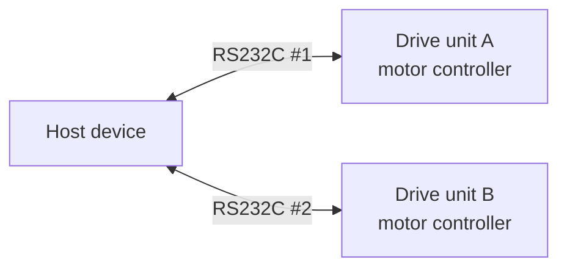
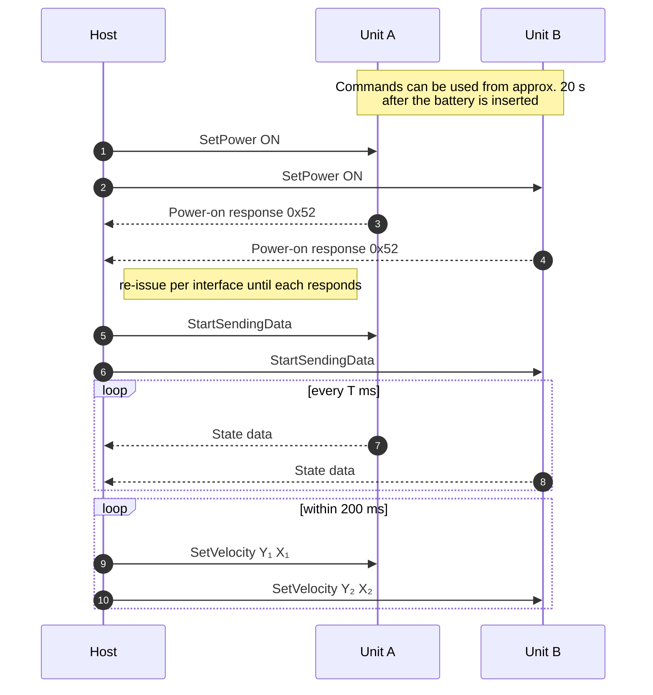

<p align="center">
  
</p>
<h1 align="center">
  WHILL Serial API Specification<br>Omni Platform
</h1>

The **WHILL Serial API** for the **Omni Platform** — the serial (RS232C) command and data interface of the holonomic four-wheel platform, provided by WHILL, Inc.

| | |
|---|---|
| **Applies to** | Omni Platform (4WD) |
| **Base specification** | [WHILL Serial API Specification (Model CR2)](https://whill.github.io/whill-serial-api/cr2/spec/) |
| **Transport** | RS232C, 38400 bps, 8-N-2 — **two independent interfaces** |
| **Serial API version** | 1.1 |
| **Revision** | Rev 1 (2026-09-01) |

> **This document describes only what differs from the Model CR2.** The Omni Platform is built from **two Model CR2 drive units**, and each unit speaks the Model CR2 Serial API unchanged. Frame format, checksum, power states, sleep behaviour, state data layout, timing constraints and connector are all defined in the base specification and are **not repeated here**. Read that document first.

**Notation:** all frame bytes are hexadecimal. `CS` = checksum byte. Ready-made frames in this document already include the correct checksum. References such as *§2 Frame Format* point to sections of the base specification.

---

## Contents

1. [Overview](#1-overview)
2. [The Two Interfaces](#2-the-two-interfaces)
3. [Motion Model](#3-motion-model)
4. [Control Commands](#4-control-commands)
5. [SetVelocity (`0x08`)](#5-setvelocity-0x08)
6. [State Data](#6-state-data)
7. [Everything Else](#7-everything-else)
8. [Revision History](#8-revision-history)

---

## 1. Overview

The Omni Platform carries **two Model CR2 drive units mounted at 90° to each other**. Combining the two units' wheel speeds makes the platform **holonomic**: it moves in any direction — forward, backward, left, right and diagonally — and rotates, all without changing the direction the wheels point.

Each drive unit has its **own motor controller and its own RS232C interface**. There is no internal link between them: the host is what makes the platform move as one vehicle, by driving both interfaces in sync.



**What this means in practice**

- Every command in this API is addressed to **one drive unit**. A command sent to a single interface moves or configures **half the platform**.
- Commands that configure the vehicle as a whole — power, device lock, auto power off — must therefore be **sent to both interfaces** to take effect as intended.
- Commands that produce motion — `SetVelocity` — must be **sent to both interfaces within the same control cycle**, because the platform's motion is the sum of both units' contributions.

### Typical startup sequence



**In normal operation a host uses three commands:** [`SetPower`](#42-commands-usable-on-the-omni-platform), [`StartSendingData`](#42-commands-usable-on-the-omni-platform) and [`SetVelocity`](#5-setvelocity-0x08).

---

## 2. The Two Interfaces

### 2.1 Naming

This document calls the two drive units **Unit A** and **Unit B**. The names are labels for the host's own bookkeeping — they are not transmitted over the wire, and the platform does not assign them.

### 2.2 Identifying which interface is which

Both interfaces are electrically and protocol-wise identical, so a host cannot tell them apart from the serial port alone. Serial port enumeration order is **not** guaranteed to be stable across reboots or re-plugging.

Establish the mapping before any motion command:

1. Send [`SetPower`](#42-commands-usable-on-the-omni-platform) ON to **one interface only**. The HMI of that drive unit lights up — this identifies which unit the interface belongs to.
2. Tilt that HMI's joystick **slightly forward**. The direction in which the platform moves is that unit's forward direction.

### 2.3 Synchronisation

The platform's motion is the combination of both units' wheel speeds, so a skew between the two `SetVelocity` frames appears as a transient deviation from the intended path.

| | Requirement |
|---|---|
| Skew between the two `SetVelocity` frames | Keep as small as practical; issue them back to back in one control cycle |
| Resend interval | **< 200 ms** on **each** interface — a value expires per unit, independently |
| Interval between consecutive commands on **one** interface | **≥ 2 ms**, as in the base specification |

The 2 ms constraint applies **per interface**, not across the pair — the two interfaces are independent and may be written to concurrently.

> **If one interface stops responding, stop the other one too.** A unit whose `SetVelocity` value has expired stops after 200 ms while the other keeps driving, which turns a communication fault into unintended motion. Host applications should treat a loss on either interface as a stop condition for the whole platform.

---

## 3. Motion Model

### 3.1 Wheel speeds within one unit

Within a single drive unit, the `SetVelocity` parameters `Y` and `X` map to its two wheels:

```
L_SPEED  ∝  Y + X
R_SPEED  ∝  Y − X
```

`Y` drives both wheels together, `X` drives them in opposition.

### 3.2 The four wheels

The two units are mounted at 90° to each other, so their wheel pairs lie on the two diagonals of the platform:

```
           front
             ▲
             │
      B ◄─┐     ┌─► A
           ╲   ╱
            ╲ ╱
             ╳        Unit A wheels on one diagonal
            ╱ ╲       Unit B wheels on the other
           ╱   ╲
      A ◄─┘     └─► B
```

Consequently:

| Host intent | Unit A | Unit B |
|---|---|---|
| Translation — any direction | `Y₁` | `Y₂` |
| Rotate | `X₁` | `X₂`, same sign and magnitude as `X₁` |

**Translation** — moving without rotating — is set by the two `Y` values. Each unit's `Y` axis is at **45° to the platform's forward direction**, and the two axes are orthogonal to each other. The platform's motion is their vector sum.

**Rotation** is set by the two `X` values, applied with the same sign and magnitude on both units.

### 3.3 Worked examples

| Motion | Unit A `SetVelocity(Y₁, X₁)` | Unit B `SetVelocity(Y₂, X₂)` |
|---|---|---|
| Forward | `(300, 0)` | `(300, 0)` |
| Backward | `(−300, 0)` | `(−300, 0)` |
| Right | `(300, 0)` | `(−300, 0)` |
| Left | `(−300, 0)` | `(300, 0)` |
| Diagonal — right backward | `(0, 0)` | `(−200, 0)` |
| Rotate clockwise | `(0, 200)` | `(0, 200)` |
| Rotate counter-clockwise | `(0, −200)` | `(0, −200)` |
| Gentle turn — forward while rotating | `(200, 100)` | `(200, 100)` |

Translation and rotation combine freely: give both units the same `X` for the rotation component and their respective `Y` for the translation component.

> ⚠️ **Avoid `|Y| = |X|` with both non-zero on a unit.** That drives one wheel of the pair to zero and the platform pivots about that wheel, which raises the current on the pivoting side. Keep `|Y|` and `|X|` distinct when both are non-zero.

### 3.4 Why the parameter range is wider than on the Model CR2

On the Model CR2, `SetVelocity` is deliberately asymmetric — forward reaches further than reverse, and the turn axis is narrower still — because a chair carrying a rider mostly moves forward.

The Omni Platform cannot use that asymmetry. **The platform's sideways motion is one unit driving fully forward while the other drives fully in reverse**, so the reverse range must equal the forward range or the platform would move to the left and right more slowly than it moves ahead. The same reasoning applies to the rotation axis.

Both axes are therefore widened to the same span — see [§5](#5-setvelocity-0x08).

---

## 4. Control Commands

### 4.1 Commands not supported on the Omni Platform

| ID | Command | Status |
|:---:|---|---|
| `0x03` | SetJoystick | **Not supported — deprecated** |
| `0x04` | SetSpeedProfile | **Not supported — deprecated** |
| `0x0B` | SetMaxSpeedLevel | **Not supported — deprecated** |
| `0x0C` | SetSpeedLevel | **Not supported — deprecated** |

`SetJoystick` drives a unit through the same path as the rider's joystick, whose acceleration and deceleration are tuned for **the comfort and safety of a person being carried**. That ramp is unsuitable for the coordinated translation of a platform: the two units must reach their target speeds together, and a profile shaped for human ride comfort does not deliver that.

`SetSpeedProfile`, `SetMaxSpeedLevel` and `SetSpeedLevel` all exist to shape or limit that same joystick path, so they have no useful effect once host motion goes through `SetVelocity` — which is independent of the speed profile and uses a constant acceleration.

Use [`SetVelocity`](#5-setvelocity-0x08) for all host-commanded motion on the Omni Platform.

> These commands are still *accepted* by the individual drive units — they are Model CR2 units. They are listed as not supported because the resulting platform motion is not specified and not validated. Do not use them.

### 4.2 Commands usable on the Omni Platform

All remaining commands of the base specification may be used. **Send each one to both interfaces.**

| ID | Command | Notes for the Omni Platform |
|:---:|---|---|
| `0x00` | StartSendingData | Per interface. Each unit streams its own state data. |
| `0x01` | StopSendingData | Per interface. |
| `0x02` | SetPower | Both units must be powered on before the platform can move. Re-issue per interface until each returns its own power-on response. |
| `0x08` | [SetVelocity](#5-setvelocity-0x08) | The motion command. Parameter range differs from the Model CR2. |
| `0x09` | SetDeviceLock | Lock both units. A platform with one unit locked cannot be driven and cannot be powered on on that side. |
| `0x0A` | SetJoystickPause | Pauses the rider joystick's effect on driving. Apply to both units. |
| `0x0D` | SoundHorn | Sending it to both interfaces sounds both units' horns. Send it to one interface if a single sound is wanted. |
| `0x0E` | SetAutoPowerOff | Set both units the same way, so that they do not power off at different times. |
| `0x0F` | GetSettings | Answers per interface. Each unit reports its own settings. |
| `0x10` | GetCapability | Answers per interface. Reports the Model CR2 capability of that unit; it does **not** describe the Omni Platform, so the commands in [§4.1](#41-commands-not-supported-on-the-omni-platform) appear as published. |

Frame layouts, fields and ready-made frames for these commands are unchanged — see *§4 Control Commands* of the base specification.

> **A rider joystick is present** on the Omni Platform. `SetVelocity` hands control between the rider and the host exactly as on the Model CR2, and the joystick values keep streaming in data set 1 on each unit.

---

## 5. SetVelocity (`0x08`)

Sets the velocity of one drive unit directly. This is the only motion command for the Omni Platform.

```
AF 07 08 U0 Y1 Y0 X1 X0 CS
```

| Field | Description |
|---|---|
| `U0` | `0` = host control — apply `Y` / `X`<br>`1` = do not apply any value; control stays with the rider |
| `Y1` `Y0` | Front/back velocity, 16-bit signed, **−1500 … 1500**, unit 0.004 km/h |
| `X1` `X0` | Left/right velocity, 16-bit signed, **−1500 … 1500**, unit 0.004 km/h |

Example — unit at 1.2 km/h along its own axis, no rotation: `AF 07 08 00 01 2C 00 00 8D`

### 5.1 Difference from the Model CR2

| | Model CR2 | Omni Platform |
|---|---|---|
| `Y` range | −500 … 1500 | **−1500 … 1500** |
| `X` range | −750 … 750 | **−1500 … 1500** |

Everything else is unchanged: unit 0.004 km/h, constant acceleration of approximately 1.7 m/s², independent of the speed profile, out-of-range values limited rather than rejected, and a validity of **200 ms** per command.

### 5.2 Using it on the platform

- Send `SetVelocity` to **both interfaces every control cycle**, back to back. A unit that stops receiving it coasts to a stop after 200 ms on its own, independently of the other.
- Both units must have `U0 = 0` for the platform to be under host control.
- Derive `Y₁`, `Y₂`, `X₁`, `X₂` from the intended platform motion as described in [§3](#3-motion-model).

> ⚠️ **The platform accelerates aggressively with this command**, as the Model CR2 does. Ramp the target velocity up gradually rather than stepping to the target in one cycle — and note that the wider range of this specification allows a considerably faster reverse and rotation than a Model CR2 reaches.

---

## 6. State Data

Each drive unit streams the Model CR2 state data unchanged, on its own interface. Data set 0 and data set 1 layouts are defined in *§5 State Data* of the base specification.

The host therefore receives **two independent streams**, and reads platform state by combining them:

| Field | Reading it on the platform |
|---|---|
| `RIGHT_MOTOR_ANGLE` / `LEFT_MOTOR_ANGLE` | Two wheels per unit — **four in total**. All four are needed for the platform's odometry, together with each unit's own `ANGLE_DETECT_COUNTER`. |
| `RIGHT_MOTOR_SPEED` / `LEFT_MOTOR_SPEED` | Per unit — the two wheels of that drive unit. |
| `BATTERY_POWER`, `BATTERY_CURRENT` | Reported per unit. Take the **lower** battery level of the two as the platform's usable level. |
| `ERROR` | Per unit. A non-zero code on **either** unit is a platform fault. |
| `POWER_ON` | Per unit. The platform is operational only when both report power on. |
| `TRIP_DISTANCE` | Counted per unit. The two values are not interchangeable and neither is the platform's travel distance on its own. |
| `JOY_FRONT`, `JOY_SIDE` | The rider joystick as read by that unit. |
| `SPEED_LEVEL`, `MAX_SPEED_LEVEL`, `SPEED_MODE_INDICATOR` | Still streamed, and still reflect the rider-side setting on that unit. The host must not set them — see [§4.1](#41-commands-not-supported-on-the-omni-platform). |

> The two streams are not synchronised with each other. Each unit sends on its own timer, so frames from the two interfaces interleave arbitrarily even when both were started with the same interval. Timestamp on arrival per interface rather than assuming frames pair up.

---

## 7. Everything Else

The following are identical to the Model CR2 and are defined in the base specification. They apply **per drive unit**.

| Topic | Base specification |
|---|---|
| Frame format and checksum | §2 Frame Format |
| Power state, sleep and wake-up | §3 Power State and Sleep |
| Command frames and fields | §4 Control Commands |
| State data layout and notes | §5 State Data |
| Response data | §6 Response Data |
| Timing constraints and RS232C parameters | §7 Timing & Electrical |
| Connector and pin assignment | §8 Connector |

Two points worth restating, because they apply to each unit independently:

- **The wake-up frame is consumed per interface.** If the platform may be asleep, send the command twice with at least 100 ms in between, on **each** interface.
- **Settings are reset when a battery is removed and re-inserted**, per unit. After a battery change, re-apply settings to that unit.

---

## 8. Revision History

| Rev | Date | Changes |
|---|---|---|
| 1 | 2026-09-01 | Initial public release, covering Serial API 1.1 on the Omni Platform. Derived from the internal document *WHILL Control System Protocol Specification for Omni Platform* Rev 6, rewritten against the Model CR2 Serial API Specification. |
